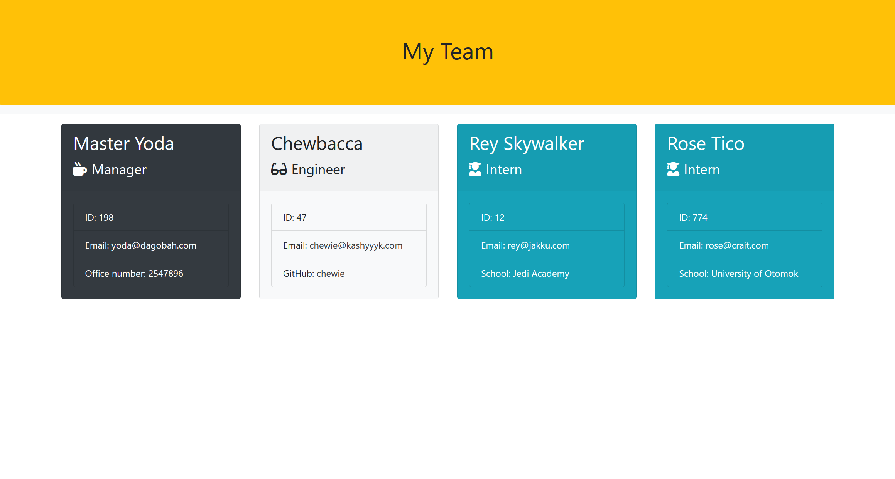

# generate-team-profile

## Module 12 Object-Oriented Programming: Team Profile Generator

## Table of Content
* [Overview](#Overview)
* [Screenshots](#Screenshots)
* [Links](#Links)
* [My_process](#My_process)
* [Built_with](#Built_with)
* [What_I_learned](#What_I_learned)
* [Author](#Author)
* [Sources](#Sources)

## Overview

The task is to take the given starter code and convert it into a working Node.js command-line application. This application will take in information about employees on a software engineering team, then generates an HTML webpage that displays summaries for each person. 

## Screenshots

[prompt questions in node](./assets/images/Screenshot%20prompts.png)
[error messages in node](./assets/images/Screenshot-error-answers.png)

### Links
[https://github.com/hszilvi/generate-team-profile]

### My_process
* Create a command-line application that accepts user input using the provided starter code.   
  * Create classes for each team member provided and export them. The tests for these classes (in the `_tests_` directory) must ALL pass.     
      * Write code in `index.js` that uses inquirer to gather information about the development team members and creates objects for each team member using the correct classes as blueprints.
    * When a user starts the application then they are prompted to enter the **team manager**’s required data.
    * When a user enters those requirements then the user is presented with a menu with the option to:
      * Add an engineer
      * Add an intern 
      * Finish building the team
    * When a user selects the **engineer** option then a user is prompted to enter required data then user is taken back to the menu.
    * When a user selects the intern option then a user is prompted to enter the required data then the user is taken back to the menu.
    * When a user decides to finish building their team then they exit the application, and the HTML is generated.

### Build_with

### What_I_Learned
I learned how to use classes, constructor function and how to navigate between separated js files. 

## Author
Szilvia Horvath
GitHub[https://github.com/hszilvi]
LinkedIn[https://www.linkedin.com/in/horvathszilvi/]
